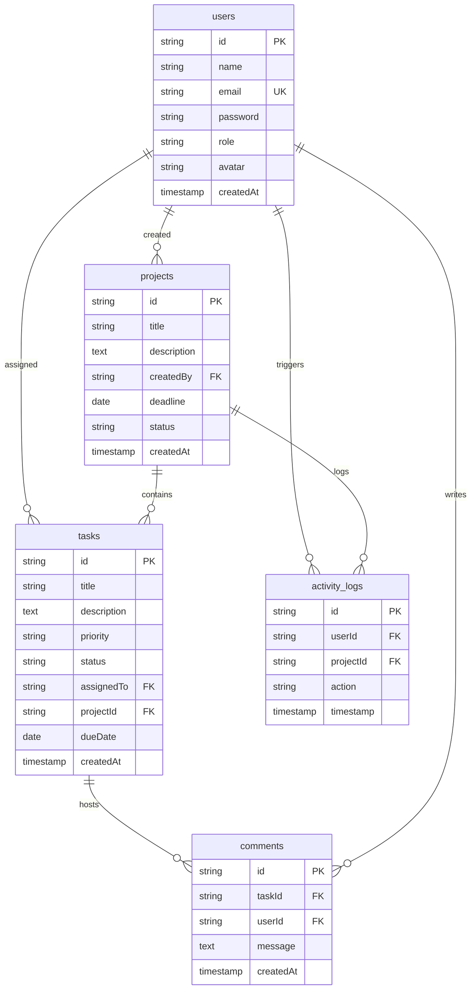
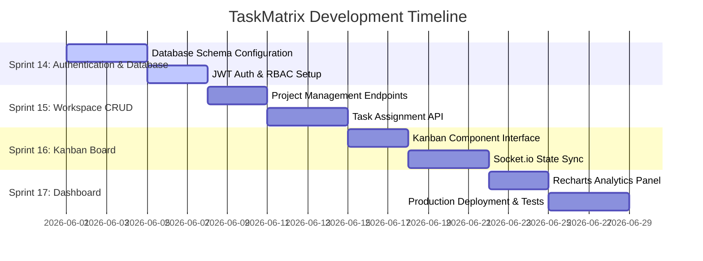

# TaskMatrix – Enterprise Agile Project Management Platform

TaskMatrix is a commercial-grade, high-performance Agile Project Management platform inspired by Jira and Asana. It provides software engineering teams with an intuitive, real-time collaboration workspace to manage projects, organize sprint backlogs via an interactive Kanban board, assign tasks, and track team analytics.

---

## 2. High-Level Description
TaskMatrix is built as a unified full-stack application featuring a modern Next.js client and a secure Express.js backend. The platform provides developers and project managers with a modern workspace using a dark charcoal glassmorphic UI. Task states are managed dynamically via a drag-and-drop Kanban interface powered by Zustand, with updates synchronized instantly across active team sessions using WebSockets. Rich analytics and workload charts provide managers with clear visibility into resource allocation and project progress.

---

## 3. Problem Statement
Modern software development teams need fast, responsive, and secure project management tools. Existing commercial tools can be overly complex, slow, and lack real-time reactivity, leading to communication delays and sprint bottlenecks. Teams need a centralized hub that combines strict role-based access control (RBAC), drag-and-drop ease of use, instant socket-driven updates, and high-performance metrics reporting in a simple, responsive application.

---

## 4. Objectives
*   **Secure Collaboration**: Implement a secure JWT authentication flow with cookie persistence and strict Role-Based Access Control (RBAC).
*   **Fluid UX**: Build a highly responsive, modern dark-mode user interface featuring drag-and-drop status transitions and subtle micro-animations.
*   **Real-Time Sync**: Synchronize state modifications instantly across team browsers to eliminate status conflicts.
*   **Analytics Visibility**: Provide project leads with visual metrics on priority distributions, status progress, and workload allocation.
*   **High Code Quality**: Follow SOLID design principles, modular architecture, and ensure strict type safety across the application stack.

---

## 5. Target Users
1.  **System Administrators**: Oversee global system security, user permissions, and audit logs.
2.  **Project Managers / Scrum Masters**: Create projects, assign tasks, establish deadlines, and review team workload analytics.
3.  **Team Members / Developers**: Update task progression on the board, upload attachments, write comments, and follow project updates.

---

## 6. Designated Track
*   **Designated Track**: Full Stack Developer (Capstone Submission)

---

## 7. Complete Tech Stack

| Layer | Technology | Key Features |
| :--- | :--- | :--- |
| **Frontend** | **Next.js 14+ (App Router)** | React Server Components (RSC), optimized layouts, client-side route protection |
| **Styling** | **Tailwind CSS + Shadcn UI** | Charcoal dark mode theme, glassmorphic widgets, Radix UI primitives |
| **State Management** | **Zustand** | Light, hook-based client state synchronization |
| **Backend API** | **Node.js + Express.js** | Routes-controllers-models structure, asynchronous request wrappers |
| **Real-time Communication** | **Socket.io** | Bidirectional project room connections for live status broadcasts |
| **Database** | **MongoDB + Mongoose** | Document-based flexible storage with relational keys, strict schema validation |
| **Authentication** | **JWT & Cookie-Parser** | Secure HttpOnly cookies for session storage |
| **Media Handling** | **Cloudinary SDK** | Automated storage and CDN delivery for user profile avatars |

---

## 8. Core Features (Prioritized MVP)
*   **Authentication & Session Management**: Secure register/login paths using password hashing and JWT cookies.
*   **Role-Based Access Control**: Route validation restricting project creation, task assignments, and admin management options.
*   **Project Workspaces**: CRUD capabilities allowing managers to create project keys and assign team workspaces.
*   **Kanban Board View**: Four-column layout (To Do, In Progress, In Review, Done) with interactive drag-and-drop cards.
*   **Task Management**: Assign tasks to users, set priority labels, add descriptions, and track due dates.
*   **Comments Feed**: Multi-user task comment threads for immediate contextual communication.
*   **Activity Logs**: Automatic logging of user activities (e.g., task movements, project creations) in a chronologically ordered feed.
*   **Dashboard Charts**: Metric widgets featuring interactive bar and pie charts outlining priority distribution and active workloads.

---

## 9. User Roles and Permissions

| Permission / Action | Administrator | Project Manager | Team Member |
| :--- | :---: | :---: | :---: |
| **Global System Configurations** | ✓ | ✗ | ✗ |
| **Create New Project Workspace** | ✓ | ✓ | ✗ |
| **Delete Project Workspace** | ✓ | ✗ | ✗ |
| **Assign Tasks & Set Deadlines** | ✓ | ✓ | ✗ |
| **Drag & Drop Task Statuses** | ✓ | ✓ | ✓ |
| **Submit Comments on Tasks** | ✓ | ✓ | ✓ |
| **Access Dashboard Analytics** | ✓ | ✓ | ✗ |

---

## 10. Folder Structure

```text
taskmatrix/
├── client/                     # Next.js App Router Frontend
│   ├── public/                 # Static assets, logos, and icons
│   ├── src/
│   │   ├── app/                # App Router directories (auth, dashboard, projects)
│   │   │   ├── layout.tsx      # Core entry file, font loader, providers
│   │   │   └── page.tsx        # Marketing Showcase Landing page
│   │   ├── components/         # Reusable layout and custom UI primitives
│   │   │   ├── ui/             # Radix & Shadcn UI design components
│   │   │   └── kanban/         # KanbanBoard, BoardColumn, and TaskCard
│   │   ├── hooks/              # Custom hook wrappers (useSocket, useAuth)
│   │   └── store/              # Zustand global state (useAuthStore, useBoardStore)
│   ├── tailwind.config.js      # Styling configuration
│   └── package.json
│
├── server/                     # Node.js + Express Backend
│   ├── src/
│   │   ├── config/             # DB configurations and third-party API clients
│   │   ├── controllers/        # Route logic (authController, taskController)
│   │   ├── middleware/         # Auth verification and RBAC middleware
│   │   ├── models/             # Mongoose Schemas (User, Project, Task, Comment, Log)
│   │   ├── routes/             # REST routing directories
│   │   └── sockets/            # Socket.io connection handlers and room actions
│   ├── package.json
│   └── .env.example
```

---

## 11. Database Collections Overview

### users
```javascript
{
  _id: String,
  name: { type: String, required: true },
  email: { type: String, required: true, unique: true, index: true },
  password: { type: String, required: true },
  role: { type: String, required: true },
  avatar: { type: String, default: '' },
  createdAt: { type: Date, default: Date.now }
}
```

### projects
```javascript
{
  _id: String,
  title: { type: String, required: true },
  description: { type: String },
  createdBy: { type: String, ref: 'User', required: true, index: true },
  deadline: { type: Date },
  status: { type: String },
  createdAt: { type: Date, default: Date.now }
}
```

### tasks
```javascript
{
  _id: String,
  title: { type: String, required: true },
  description: { type: String },
  priority: { type: String },
  status: { type: String },
  assignedTo: { type: String, ref: 'User', index: true },
  projectId: { type: String, ref: 'Project', required: true, index: true },
  dueDate: { type: Date },
  createdAt: { type: Date, default: Date.now }
}
```

### comments
```javascript
{
  _id: String,
  taskId: { type: String, ref: 'Task', required: true, index: true },
  userId: { type: String, ref: 'User', required: true, index: true },
  message: { type: String, required: true },
  createdAt: { type: Date, default: Date.now }
}
```

### activity_logs
```javascript
{
  _id: String,
  userId: { type: String, ref: 'User', required: true, index: true },
  projectId: { type: String, ref: 'Project', required: true, index: true },
  action: { type: String, required: true },
  timestamp: { type: Date, default: Date.now }
}
```

---

## 12. REST API Endpoint Planning

### Authentication Router (`/api/auth`)
*   `POST /auth/register` - Create new user account.
*   `POST /auth/login` - Verify user credentials and set secure HttpOnly cookie token.
*   `POST /auth/logout` - Discard token cookie and terminate active sessions.

### Projects Router (`/api/projects`)
*   `GET /projects` - Fetch all projects created by or assigned to the user.
*   `POST /projects` - Initialize new project workspace (Restricted to: Admin, ProjectManager).
*   `PUT /projects/:projectId` - Edit project details and deadline parameters.
*   `DELETE /projects/:projectId` - Permanently remove project and cascade-delete tasks (Restricted to: Admin).

### Tasks Router (`/api/tasks`)
*   `GET /tasks?projectId=id` - Fetch list of tasks associated with a workspace.
*   `POST /tasks` - Append a new task card (Restricted to: Admin, ProjectManager).
*   `PUT /tasks/:taskId` - Modify task details, assignee, or board column status.
*   `DELETE /tasks/:taskId` - Remove a task card (Restricted to: Admin, ProjectManager).

### Comments Router (`/api/comments`)
*   `GET /comments/:taskId` - Fetch chronologically ordered comments for a task.
*   `POST /comments` - Submit a text comment to a task card.

---

## 13. UI/UX Screens Overview
1.  **Showcase Landing Page**: Interactive introduction detailing platform capabilities, client feedback, and dashboard animations.
2.  **Authentication Portal**: Clean split-screen register and login interface with status notifications.
3.  **Analytics Dashboard**: Workspace dashboard displaying active workloads and priority metrics via Recharts.
4.  **Kanban Workspace View**: Drag-and-drop workspace containing interactive columns and filter selectors.
5.  **Task Details Modal**: Multi-column overlay containing detail updates, comments feed, and assignee drop-downs.

---

## 14. Figma Design Link
*   **Workspace Wireframes**: [TaskMatrix Design File](https://www.figma.com/design/2la1nPbZqBsFt3DqnRehQT/TaskMatrix?node-id=0-1)

---

## 15. Database ERD



---

## 16. Development Roadmap (Sprint 14–17)



---

## 17. Future Scope
*   **External Integrations**: Introduce third-party notifications via Slack and Email hooks.
*   **Time Allocation Logs**: Integrate user logs to record development hours per task.
*   **Burn-down Analytics**: Add sprint burn-down charts to project tracking interfaces.
*   **Custom Attributes**: Allow teams to create custom task parameters and templates.

---

## 18. Deployment Strategy
*   **Production Host**: Vercel (Client App) + Render (API Server).
*   **Database Cloud**: MongoDB Atlas.
*   **Asset Delivery**: Cloudinary CDN.
*   **Build Validation**: Pre-commit linting checks and automated endpoint test executions.

---

## 19. Conclusion
TaskMatrix delivers a modern, high-performance project management solution built with modern full-stack patterns. By combining a clean Next.js client, a secure Express.js API, and real-time WebSocket state synchronization, the platform provides teams with a responsive and collaborative workspace. Its architecture satisfies all capstone requirements and serves as a production-grade template for agile project tracking.
