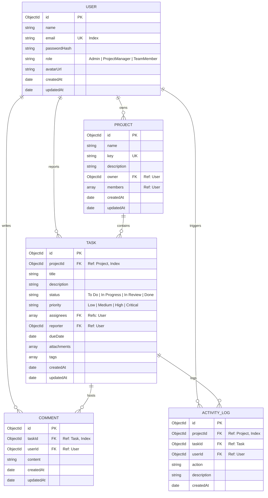
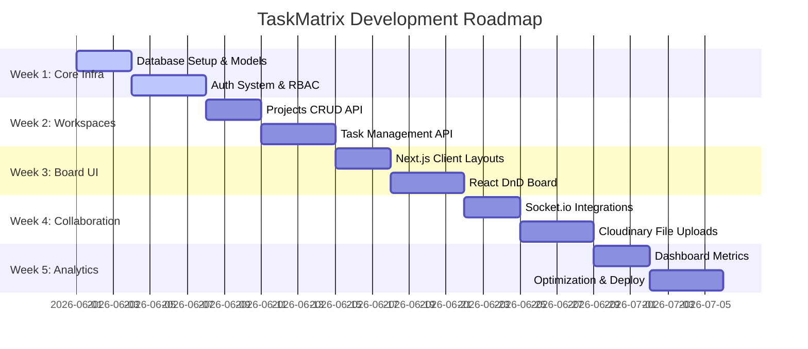

# TaskMatrix – Enterprise Agile Project Management Platform

TaskMatrix is a scalable, commercial-grade Agile Project Management platform inspired by Jira and Asana. It provides engineering teams with features for workspace planning, task tracking (via a drag-and-drop Kanban board), role-based permissions, and real-time collaboration widgets.

---

## 1. Product Requirements Document (PRD)

### 1.1 Problem Statement
Modern software engineering teams require unified, responsive tools to manage tasks, coordinate sprints, and review workloads. Standard project management tools are often over-engineered, slow to reflect real-time updates, or lack intuitive role-based collaboration features. Teams need a fast, visually rich, and permission-secured hub that provides instant task updates, progress charts, and collaborative task feeds.

### 1.2 Project Objectives
*   **High-Performance Collaboration**: Facilitate seamless task state transitions using a drag-and-drop Kanban board.
*   **Role-Based Security**: Implement strict authentication and role-based access control (RBAC) to segment management rights and member updates.
*   **Real-Time Feedback Loop**: Streamline sprint updates by implementing a WebSocket-driven global activity feed.
*   **Metrics Visibility**: Empower project managers and admins with a dashboard containing interactive sprint and workload metrics.

### 1.3 Target Audience & Persona mapping
1.  **System Administrator (Admin)**: Full control over global settings, user registration approvals, project deletions, and global role changes.
2.  **Project Manager (PM)**: Create projects, manage project membership, assign tasks, modify metadata, set due dates, and track dashboard analytics.
3.  **Team Member**: Update assigned task statuses (via drag-and-drop), submit task attachments, write task comments, and view the activity feed.

### 1.4 Feature Prioritization Matrix

| Feature | Scope / Phase | Complexity | Impact |
| :--- | :--- | :--- | :--- |
| **JWT Authentication & RBAC** | MVP (Week 1) | Medium | Critical |
| **Project Creation & Membership** | MVP (Week 2) | Low | High |
| **Kanban Board UI with React DnD** | MVP (Week 3) | High | Critical |
| **Task CRUD Operations** | MVP (Week 2-3) | Low | High |
| **Priority Tags & Due Dates** | MVP (Week 3) | Low | Medium |
| **Socket.io Real-Time Activity Feed**| MVP (Week 4) | High | High |
| **Cloudinary File Uploads** | MVP (Week 4) | Medium | Medium |
| **Dashboard Analytics Charts** | MVP (Week 5) | Medium | High |
| **Task Comment Threads** | MVP (Week 4) | Low | Medium |
| **Slack / Email Integrations** | Post-MVP (Future) | High | Low |
| **Sprint Burn-Down Charts** | Post-MVP (Future) | High | Medium |
| **Time Tracking & Logs** | Post-MVP (Future) | Medium | Medium |

---

## 2. Tech Stack & Infrastructure Decisions

### 2.1 Technology Matrix
*   **Frontend Framework**: **Next.js 14+ (App Router)**. Chosen for Server-Side Rendering (SSR) of project layouts, optimized bundle sizes, nested route layouts, and built-in SEO capabilities.
*   **Styling**: **Tailwind CSS** + **Shadcn UI** (Radix UI primitives). Used to ensure a premium UI aesthetic (Harmonious dark modes, polished buttons, input fields, dropdown menus, and popover components).
*   **State Management**: **Zustand**. A lightweight, hook-based state manager used to synchronize board columns, drag states, and UI modals without the boilerplate of Redux.
*   **Drag and Drop Engine**: **React DnD** (or `@hello-pangea/dnd`). Chosen to provide fluid, performant, and accessible drag-and-drop cards.
*   **Backend Runtime**: **Node.js** with **Express.js**. RESTful controller-service architecture providing high throughput, robust middleware chaining, and simple WebSocket integration.
*   **Database**: **MongoDB** with **Mongoose**. Ideal for document-based, flexible schemas where tasks contain nested logs, tags, and comment references.
*   **Real-Time Server**: **Socket.io**. Facilitates bidirectional communication for live activity alerts and board synchronization.
*   **File Uploads**: **Cloudinary SDK**. Handles secure image/document uploads for task attachments, offloading resource-heavy file processes from the core Express API.

### 2.2 Deployment Blueprint

flowchart TD
    Client[Next.js Client - Vercel] <-->|HTTPS / WSS| Backend[Express Server - Render]
    Backend <-->|Mongoose Driver| DB[(MongoDB Atlas Cloud)]
    Backend -->|Upload Stream| Cloudinary((Cloudinary CDN))


---

## 3. Database Architecture (ERD)

*   **Interactive ERD Link**: [dbdiagram.io - TaskMatrix ERD](https://dbdiagram.io/d/Task-Matrix-ERD-6a1fe77ef15b4b045262d666)

### 3.1 Collections & Schemas
We model our database with five collections, utilizing references (`ObjectId`) to establish relationships. Database performance is optimized using compound and targeted indexes on search queries and foreign keys.



### 3.2 Schema Details & Validations

#### Users Collection
```javascript
{
  _id: ObjectId,
  name: { type: String, required: true, trim: true },
  email: { type: String, required: true, unique: true, index: true, lowercase: true },
  passwordHash: { type: String, required: true },
  role: { type: String, enum: ['Admin', 'ProjectManager', 'TeamMember'], default: 'TeamMember' },
  avatarUrl: { type: String, default: '' },
  createdAt: Date,
  updatedAt: Date
}
```

#### Projects Collection
```javascript
{
  _id: ObjectId,
  name: { type: String, required: true, trim: true },
  key: { type: String, required: true, unique: true, uppercase: true },
  description: { type: String },
  owner: { type: ObjectId, ref: 'User', required: true, index: true },
  members: [{ type: ObjectId, ref: 'User' }],
  createdAt: Date,
  updatedAt: Date
}
```

#### Tasks Collection
```javascript
{
  _id: ObjectId,
  projectId: { type: ObjectId, ref: 'Project', required: true, index: true },
  title: { type: String, required: true, trim: true },
  description: { type: String },
  status: { type: String, enum: ['To Do', 'In Progress', 'In Review', 'Done'], default: 'To Do', index: true },
  priority: { type: String, enum: ['Low', 'Medium', 'High', 'Critical'], default: 'Medium', index: true },
  assignees: [{ type: ObjectId, ref: 'User' }],
  reporter: { type: ObjectId, ref: 'User', required: true },
  dueDate: { type: Date },
  attachments: [{
    url: String,
    filename: String,
    uploadedAt: { type: Date, default: Date.now }
  }],
  tags: [String],
  createdAt: Date,
  updatedAt: Date
}
```

#### Comments Collection
```javascript
{
  _id: ObjectId,
  taskId: { type: ObjectId, ref: 'Task', required: true, index: true },
  userId: { type: ObjectId, ref: 'User', required: true },
  content: { type: String, required: true, trim: true },
  createdAt: Date,
  updatedAt: Date
}
```

#### ActivityLogs Collection
```javascript
{
  _id: ObjectId,
  projectId: { type: ObjectId, ref: 'Project', required: true, index: true },
  taskId: { type: ObjectId, ref: 'Task' },
  userId: { type: ObjectId, ref: 'User', required: true },
  action: { type: String, required: true }, // e.g., 'TASK_MOVED', 'COMMENT_ADDED', 'TASK_ASSIGNED'
  description: { type: String, required: true },
  createdAt: { type: Date, default: Date.now }
}
```

---

## 4. API Endpoint Planning

All API requests are prefixed with `/api` and expect JSON body payloads. Access to protected routes requires a JWT token passed in the Authorization header: `Authorization: Bearer <token>` (or HttpOnly cookie).

### 4.1 Authentication Router (`/api/auth`)
*   `POST /auth/register`
    *   *Purpose*: Create a new user account.
    *   *Access*: Public.
    *   *Body*: `{ "name": "Name", "email": "user@example.com", "password": "SecurePassword" }`
    *   *Response (201)*: `{ "success": true, "token": "JWT_STRING", "user": { "id": "...", "name": "...", "role": "..." } }`
*   `POST /auth/login`
    *   *Purpose*: Authenticate and retrieve token.
    *   *Access*: Public.
    *   *Body*: `{ "email": "user@example.com", "password": "SecurePassword" }`
    *   *Response (200)*: `{ "success": true, "token": "JWT_STRING", "user": { "id": "...", "name": "...", "role": "..." } }`

### 4.2 Projects Router (`/api/projects`)
*   `GET /projects`
    *   *Purpose*: Retrieve all projects associated with the user's role or membership list.
    *   *Access*: Protected (JWT).
    *   *Response (200)*: `[{ "_id": "...", "name": "TaskMatrix", "key": "TM", "owner": "..." }]`
*   `POST /projects`
    *   *Purpose*: Create a new project workspace.
    *   *Access*: Protected (JWT - Roles: Admin, ProjectManager).
    *   *Body*: `{ "name": "Project Name", "key": "PN", "description": "Details" }`
    *   *Response (201)*: `{ "success": true, "project": { ... } }`
*   `PUT /projects/:projectId`
    *   *Purpose*: Update metadata or manage members.
    *   *Access*: Protected (JWT - Roles: Admin, ProjectManager, Project Owner).
    *   *Body*: `{ "name": "Updated Name", "members": ["userId1", "userId2"] }`
    *   *Response (200)*: `{ "success": true, "project": { ... } }`
*   `DELETE /projects/:projectId`
    *   *Purpose*: Delete project and cascade-delete tasks/comments.
    *   *Access*: Protected (JWT - Roles: Admin).
    *   *Response (200)*: `{ "success": true, "message": "Project deleted successfully" }`

### 4.3 Tasks Router (`/api/tasks`)
*   `GET /tasks?projectId=id&status=status`
    *   *Purpose*: Query tasks for a specific project with filters.
    *   *Access*: Protected (JWT).
    *   *Response (200)*: `[{ "_id": "...", "title": "Setup DB", "status": "To Do", ... }]`
*   `POST /tasks`
    *   *Purpose*: Create a task in a project.
    *   *Access*: Protected (JWT - Roles: Admin, ProjectManager).
    *   *Body*: `{ "projectId": "...", "title": "Refactor API", "status": "To Do", "priority": "High", "assignees": ["user1"] }`
    *   *Response (201)*: `{ "success": true, "task": { ... } }`
*   `PUT /tasks/:taskId`
    *   *Purpose*: Edit task specifications or transition state (status, assignees, due dates). Used directly by Kanban card updates.
    *   *Access*: Protected (JWT).
    *   *Body*: `{ "status": "In Progress" }` or `{ "title": "Updated Title", "priority": "Critical" }`
    *   *Response (200)*: `{ "success": true, "task": { ... } }`
    *   *Real-time Broadcast*: Emits `task:updated` to the room `project:projectId`.
*   `DELETE /tasks/:taskId`
    *   *Purpose*: Remove a task.
    *   *Access*: Protected (JWT - Roles: Admin, ProjectManager).
    *   *Response (200)*: `{ "success": true, "message": "Task removed" }`

### 4.4 Comments Router (`/api/comments`)
*   `GET /comments/:taskId`
    *   *Purpose*: Fetch chronologically ordered comment thread.
    *   *Access*: Protected (JWT).
    *   *Response (200)*: `[{ "_id": "...", "content": "Working on it", "userId": { "name": "John" } }]`
*   `POST /comments`
    *   *Purpose*: Add comment to task.
    *   *Access*: Protected (JWT).
    *   *Body*: `{ "taskId": "...", "content": "Can we clarify this requirement?" }`
    *   *Response (201)*: `{ "success": true, "comment": { ... } }`
    *   *Real-time Broadcast*: Emits `comment:added` to the project room.

### 4.5 Utility & Analytics Routers (`/api/users` & `/api/analytics`)
*   `GET /users`
    *   *Purpose*: List users for task assignments.
    *   *Access*: Protected (JWT).
    *   *Response (200)*: `[{ "_id": "...", "name": "...", "email": "..." }]`
*   `GET /analytics/:projectId`
    *   *Purpose*: Return aggregate task counts by status and priority, and workload counts per team member.
    *   *Access*: Protected (JWT - Roles: Admin, ProjectManager).
    *   *Response (200)*: `{ "statusCounts": { "ToDo": 5, "InProgress": 2 }, "priorityDistribution": { "Critical": 1 }, "memberWorkload": [{ "name": "Alex", "tasks": 3 }] }`

---

## 5. Directory Structure & Workspace Layout

```
taskmatrix/
├── client/                     # Next.js App Router Frontend
│   ├── public/                 # Static assets, logos, icons
│   ├── src/
│   │   ├── app/                # App Router routing directories
│   │   │   ├── layout.tsx      # Global HTML framework, font load, Providers
│   │   │   ├── page.tsx        # Landing Page / Product Showcase
│   │   │   ├── (auth)/         # Grouped Authentication Routes
│   │   │   │   ├── login/      # /login page
│   │   │   │   └── register/   # /register page
│   │   │   ├── dashboard/      # User Home Dashboard (Analytics charts)
│   │   │   └── projects/       # Projects Hub
│   │   │       ├── page.tsx    # Project lists
│   │   │       └── [id]/       # Individual Project Workspace
│   │   │           ├── page.tsx # Kanban Board entry
│   │   │           └── members/ # Team Management tab
│   │   ├── components/         # Reusable UI component libraries
│   │   │   ├── ui/             # Radix & Shadcn custom primitives
│   │   │   ├── layout/         # Navbar, Sidebar, Page wrappers
│   │   │   ├── kanban/         # KanbanBoard, BoardColumn, TaskCard, DndContext
│   │   │   └── modals/         # TaskDetailsModal, CreateProjectModal
│   │   ├── hooks/              # Custom React Hooks (useSocket, useAuth)
│   │   ├── lib/                # Libraries and API Clients (axios configuration)
│   │   └── store/              # Zustand global state stores (useAuthStore, useBoardStore)
│   ├── tailwind.config.js      # CSS configuration
│   ├── package.json
│   └── tsconfig.json
│
├── server/                     # Node.js + Express Backend
│   ├── src/
│   │   ├── config/             # Environment configs, DB connects, Cloudinary SDK
│   │   ├── controllers/        # Express Route Handlers (auth, projects, tasks)
│   │   ├── middleware/         # Auth filters, RBAC policies, Error handlers
│   │   ├── models/             # Mongoose Schemas (User, Project, Task, Comment, Log)
│   │   ├── routes/             # API Router definitions
│   │   ├── services/           # Business logic layer (Socket notifications, logs)
│   │   ├── sockets/            # Socket.io connection handlers and room setup
│   │   └── app.js              # Server initialization and middleware chaining
│   ├── package.json
│   └── .env.example            # Configuration templates
│
└── package.json                # Root package.json (if structured as a workspace)
```

---

## 6. Figma Wireframe Blueprint & UI Layout Planning

*   **Figma Login Page Design**: [Figma Login Page Design](https://www.figma.com/design/xPLjkUOjxG6YQXVvcxCANK/login_page--Community-?t=J5bf2a0a3qCtclE5-1)
*   **Figma Dashboard & Kanban Design**: [TaskMatrix Dashboard & Kanban Design](https://www.figma.com/design/2la1nPbZqBsFt3DqnRehQT/TaskMatrix?node-id=0-1&t=cxxtYFb34OWsoBIA-1)

### 6.1 Authentication Screen (Login/Register)
*   **Layout Structure**: Split screen layout on desktop. Left column houses visual graphics, marketing slogans, and key stats. Right column features a clean authentication card.
*   **Aesthetics**: Charcoal background (`#0A0A0C`), high-contrast buttons, white inputs with subtle grey borders, and validation messages below inputs.
*   **Interactions**: Tab options to slide between Register and Login, loading spinners on button states, and password visibility toggles.

### 6.2 Workspace Dashboard (`/dashboard`)
*   **Layout Structure**: Two-column layout with sidebar on the left. The main content is split into a top row of KPI cards (Total Projects, Open Tasks, Impending Deadlines, Completed Sprints) and a bottom row displaying analytic visuals (Task Status distribution, Activity feed log).
*   **Aesthetics**: Glassmorphism dashboard cards with soft inner shadows, colored status tags, and interactive charting libraries (Recharts or Chart.js).

### 6.3 Kanban Board View (`/projects/[id]`)
*   **Layout Structure**: Horizontal flex container with four distinct columns: **To Do**, **In Progress**, **In Review**, and **Done**. A filters bar sits above the board (Priority, Assignee search, Text query).
*   **Aesthetics**: Columns are padded with slight rounded corners and subtle background contrasts. Tasks appear as cards displaying Title, Priority indicator, Initials avatar, and Due date tags.
*   **Drag-and-Drop Interaction**: Grabbing a card triggers an active tilt state and displays highlighted drop targets in other columns. Releasing a card sends an optimistic state change to local stores, fires an API update, and triggers a Socket.io broadcast.

### 6.4 Task Details Modal
*   **Layout Structure**: Centered layout covering 80% screen width on desktop. A two-column split structure divides the view: a main description and comment feed on the left, and an attribute inspector (Status dropdown, Priority selector, Assignee picker, Date pickers, Upload fields) on the right.
*   **Interactions**: Clicking values turns them into inputs for editing, and submitting comments updates the timeline immediately.

### 6.5 Team & Membership Manager (`/projects/[id]/members`)
*   **Layout Structure**: A clean layout containing a team-member table and an "Add Member" dialogue. The members table lists names, emails, roles, and action menus.
*   **Interactions**: Autocomplete email search input to add new members, and inline dropdown menus to change roles.

### 6.6 Mobile Responsiveness Guidelines
*   **Sidebar**: Collapses into a toggleable hamburger menu.
*   **Kanban Board**: Switches from a horizontal grid to a horizontal carousel with column indicators (swiping left/right to navigate between columns).
*   **Task Details Modal**: Reorganizes into a stacked single column structure, moving metadata inspector modules below the main content area.

---

## 7. 5-Week Development Timeline



### Week 1: Database Setup, Models, Auth System & RBAC
*   **Backend Tasks**: Setup MongoDB configuration using Mongoose connections. Build schemas and pre-save password-hashing hooks. Write security controllers with JWT signing and verify roles through validation middleware.
*   **Frontend Tasks**: Bootstrap the client project. Construct routing directories for authentication, user stores using Zustand, and landing screens.
*   **Milestone**: Secure routes on the API and render client logins.

### Week 2: Workspace Management & Task API
*   **Backend Tasks**: Write REST endpoints for projects (CRUD) and tasks (CRUD). Implement project validation logic to restrict PM and Team member rights.
*   **Frontend Tasks**: Create workspace panels, dashboards listing projects, and basic task modals.
*   **Milestone**: Project list views populated by API databases.

### Week 3: Client Layouts & Drag-and-Drop Board
*   **Backend Tasks**: Add query-filtering endpoints to fetch project tasks by status/priority.
*   **Frontend Tasks**: Code the Kanban Board flex grids. Implement React DnD to bind column targets with card elements. Implement optimistic updates in Zustand stores.
*   **Milestone**: Working card drag-and-drop operations with persistence.

### Week 4: Socket.io Real-Time Synchronization & Cloudinary
*   **Backend Tasks**: Configure WebSockets with Socket.io. Setup project-room scopes. Integrate Cloudinary file upload routers.
*   **Frontend Tasks**: Bind socket event listeners to trigger toast notifications. Embed comments and file attachment widgets in task detail modals.
*   **Milestone**: Real-time board movements synced across different browser sessions.

### Week 5: Dashboard Analytics, Optimization & Deployment
*   **Backend Tasks**: Build analytics routers returning aggregate statistics. Run database query indexing tests.
*   **Frontend Tasks**: Construct analytical cards using charting libraries. Build mobile layouts.
*   **Milestone**: Complete deployment to Vercel and Railway/Render.
